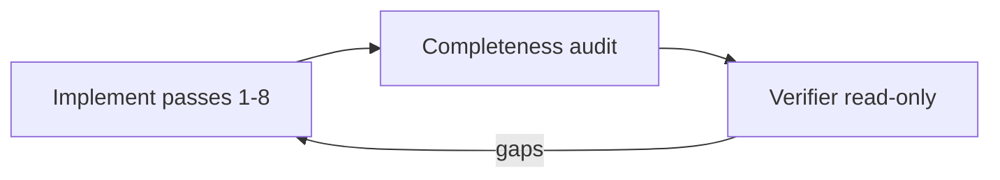

# Harmony Integration Handbook

**Kit profile — Harmony Integration Kit:** A **self-contained** Cursor bundle plus documentation for applying **Harmony design tokens and behavior** to **existing or new** apps built with **MUI** or **shadcn/ui**. The **customer app shell and all UI** are implemented in **their** framework (MUI or shadcn) — not by shipping the designer starter's `ShellLayout.tsx` tree inside the app.

All Harmony source files (CSS, icon manifest, reference shell components, custom icons) ship with this kit. No separate clone of `harmony-designer-starter` is needed.

Keep this file at the **repository root** next to `.cursor/` when you zip or share the kit.

---

## Table of contents

1. [Principle: source-driven spec](#principle-source-driven-spec)
2. [Pinned sources](#pinned-sources)
3. [Themes and modes (derive from CSS, not from chat)](#themes-and-modes-derive-from-css-not-from-chat)
4. [Mapping playbook — pass-based workflow](#mapping-playbook--pass-based-workflow)
5. [Integration workflow](#integration-workflow)
6. [Inventory document](#inventory-document)
7. [Agent workflow](#agent-workflow)
8. [Building pages](#building-pages)
9. [Design review and critique](#design-review-and-critique)
10. [What is in this kit](#what-is-in-this-kit)
11. [Relationship to Harmony Designer Starter](#relationship-to-harmony-designer-starter)
12. [Cursor bundle](#cursor-bundle)

---

## Principle: source-driven spec

**User prompts are intent, not spec.** Themes, tokens, shell behavior, icon rules, and CSS import order must be **traced to files** listed in [docs/PINNED_SOURCES.md](docs/PINNED_SOURCES.md) and filled in [docs/harmony-source-inventory.md](docs/harmony-source-inventory.md).

Do **not** treat informal chat ("only PPM and CP") as the theme list — **derive** product themes from `tokens.css` and your app root (`html` class pattern).

---

## Pinned sources

1. All source files ship in the kit under `harmony-styles/`, `harmony-data/`, `harmony-assets/`, `icons/custom/`, and `reference-components/`. Confirm paths in **[docs/PINNED_SOURCES.md](docs/PINNED_SOURCES.md)**.

2. Global CSS import order must follow `harmony-styles/global.css`: **tokens → reset → layout → components → utilities**. Import `global.css` as a single entry point or import the five sheets individually in this order.

3. **Conflict rule:** Handbook or chat vs pinned **CSS/TS** → **CSS and TS win**.

---

## Themes and modes (derive from CSS, not from chat)

In the reference snapshot, **four** product themes apply via **one** class on `<html>` at a time:

| Key | Class |
|-----|--------|
| CP | `theme-cp` |
| VP | `theme-vp` |
| PPM | `theme-ppm` |
| Maconomy | `theme-maconomy` |

**Modes:** **Light** = one `theme-*` without `dark`. **Dark** = same `theme-*` plus class **`dark`** on `<html>` (verify exact selectors in pinned `tokens.css` — each theme has `html.theme-*.dark` blocks).

**Verify** against your pin: open pinned `tokens.css` and list every `html.theme-*` block; if your org adds themes, the inventory must reflect **your** pin, not this paragraph alone.

---

## Mapping playbook — pass-based workflow

**Before you integrate, read [docs/MAPPING_PLAYBOOK.md](docs/MAPPING_PLAYBOOK.md).**

Integration follows **8 ordered passes**, each targeting one token/style category:

| Pass | Category | Source |
|------|----------|--------|
| 1 | Foundation | CSS chain, root class, dark mode, provider |
| 2 | Colors | tokens.css theme blocks (~120 tokens/theme) |
| 3 | Typography | fonts, sizes, weights, line heights |
| 4 | Spacing and Sizing | spacing scale, component sizing, breakpoints |
| 5 | Shape and Elevation | radii, shadows, focus rings, z-index, transitions |
| 6 | Component Overrides | components.css families + colocated CSS |
| 7 | Shell | layout.css + reference-components spec |
| 8 | Icons | icon manifest + rendering |

Each pass has a **concrete checklist** derived from the actual CSS files (not invented). The implement agent runs one pass at a time and updates inventory §12 after each pass.

---

## Integration workflow

Say **"integrate Harmony"** in Agent chat. The `harmony-integration` skill is auto-detected and orchestrates the full workflow:

1. **Detect** — The main agent checks `package.json`, build tool, and existing shell components to classify the project as existing app or greenfield.
2. **Delegate passes 1–8** — The main agent delegates each pass to the `harmony-implement` subagent sequentially (one pass per invocation, foreground mode). Each pass follows [docs/MAPPING_PLAYBOOK.md](docs/MAPPING_PLAYBOOK.md) and updates inventory §12.
3. **Completeness** — The main agent delegates to the `harmony-completeness` subagent for a read-only audit.
4. **Verification** — The main agent delegates to the `harmony-verifier` subagent for a final check.
5. **Loop** — If deviations found, fix and re-verify until PASS or only §13 gaps remain.

No need to choose a scenario. The detection step handles it.

### Shell rule

Implement the shell with **MUI or shadcn** only. Use `reference-components/ShellLayout.tsx` + shell CSS as **behavioral/layout spec** — rebuild in the host library.

**Mandatory:** Any UI built with the library **inherits** the same theme (no ad-hoc colors/spacing outside the mapped system unless documented as a **gap** in §13).

---

## Inventory document

- **Template and sections:** [docs/harmony-source-inventory.md](docs/harmony-source-inventory.md)
- **How to generate or refresh:** [docs/GENERATE_INVENTORY.md](docs/GENERATE_INVENTORY.md)
- **Component parity:** [docs/COMPONENT_MANIFEST.md](docs/COMPONENT_MANIFEST.md)

Agents **must** read the inventory + pinned CSS before claiming mapping work is complete.

---

## Agent workflow



- **Implement agent** (`harmony-implement`): Runs one playbook pass per invocation. Writes host-framework code; uses Harmony files as **evidence**, not as paste-in React shell. Updates §12 after each pass.
- **Completeness agent** (`harmony-completeness`): Read-only. Every inventory section has a corresponding implementation or a documented **gap**.
- **Verifier agent** (`harmony-verifier`): Read-only; deviation list only until zero deviations (per agent doc). Rejects PASS if wholesale TBD or stub content remains.

---

## Building pages

After the Harmony theme is applied (passes 1–8), use these skills to build pages:

| Skill | What it does |
|-------|-------------|
| **`/build-layout`** | Compose a single page inside the Harmony-themed shell using MUI or shadcn. |
| **layout-builder** | Composition rules, layout patterns (settings, dashboard, form, list/detail, empty state), spacing constraints. |
| **design-patterns** | 45 design pattern docs with anatomy, Component Tree, Key Elements, usage guidelines. |
| **`/build-all-patterns`** | Build all pattern pages with dual verification. |
| **`/create-pattern`** | Generate a new pattern doc from a component. |
| **`/search-patterns`** | Search the pattern registry by query, product, or category. |

**Key principle:** Build with **MUI or shadcn** components. `reference-components/` is read-only spec for expected structure and behavior — do not import it into the host app.

**Verification:** Every built page runs through the **layout-verifier** (composition constraints) and **pattern-fidelity-verifier** (pattern markdown fidelity). Max 3 fix rounds per verifier.

---

## Design review and critique

| Skill | What it does |
|-------|-------------|
| **`/harmony-critique`** | Full critique against Harmony rules + UX principles. |
| **harmony-usage-rules** | Component usage, accessibility, do's and don'ts from Harmony docs. |
| **harmony-ux-principles** | Cognitive load, progressive disclosure, entry points, system status, error prevention. |
| **`/ux-review`** | Standalone UX review (framework-agnostic, no Harmony dependency). |

---

## What is in this kit

```text
harmony-integration-kit/
├── HARMONY_INTEGRATION_HANDBOOK.md   ← this file
├── KIT_VERSION
├── CHANGELOG.md
├── AGENTS.md
├── README.md
├── harmony-styles/                   ← vendored CSS (tokens, reset, layout, components, utilities, global)
├── harmony-data/                     ← icon-manifest.json (self-contained inline SVGs)
├── harmony-assets/                   ← public SVGs (mic-slash, RS_Dela, logos/)
├── icons/custom/                     ← project-specific custom icon SVGs
├── reference-components/                  ← designer .tsx + .css (read-only spec, 48 components)
├── docs/
│   ├── PINNED_SOURCES.md
│   ├── harmony-source-inventory.md
│   ├── GENERATE_INVENTORY.md
│   ├── MAPPING_PLAYBOOK.md           ← 8-pass workflow with checklists
│   ├── COMPONENT_MANIFEST.md         ← row per reference-components component
│   └── RELEASE_SYNC.md              ← maintainer sync procedure
└── .cursor/
    ├── HARMONY_INTEGRATION_GUIDE.md
    ├── skills/
    ├── rules/
    └── agents/
```

---

## Relationship to Harmony Designer Starter

- **Independent kit.** No Astro, no `harmony-converter`.
- **Designer starter** was the source for vendored files now shipped in this kit (`harmony-styles/`, `harmony-data/`, `reference-components/`, `icons/custom/`, `harmony-assets/`).
- Maintainers sync updates from designer starter per [docs/RELEASE_SYNC.md](docs/RELEASE_SYNC.md). Consumers of this kit do not need the starter repo.

---

## Cursor bundle

| Path | Purpose |
|------|---------|
| [.cursor/HARMONY_INTEGRATION_GUIDE.md](.cursor/HARMONY_INTEGRATION_GUIDE.md) | Slash playbooks and skill index |
| [.cursor/skills/](.cursor/skills/) | 11 skills: integration hub (orchestrates subagents), 6 page building, 4 review/critique |
| [.cursor/rules/](.cursor/rules/) | 4 rules: source-first, skills location, layout composition, pattern fidelity |
| [.cursor/agents/](.cursor/agents/) | 5 agents: implement, completeness, verifier, layout-verifier, pattern-fidelity-verifier |

*End of Harmony Integration Handbook.*
